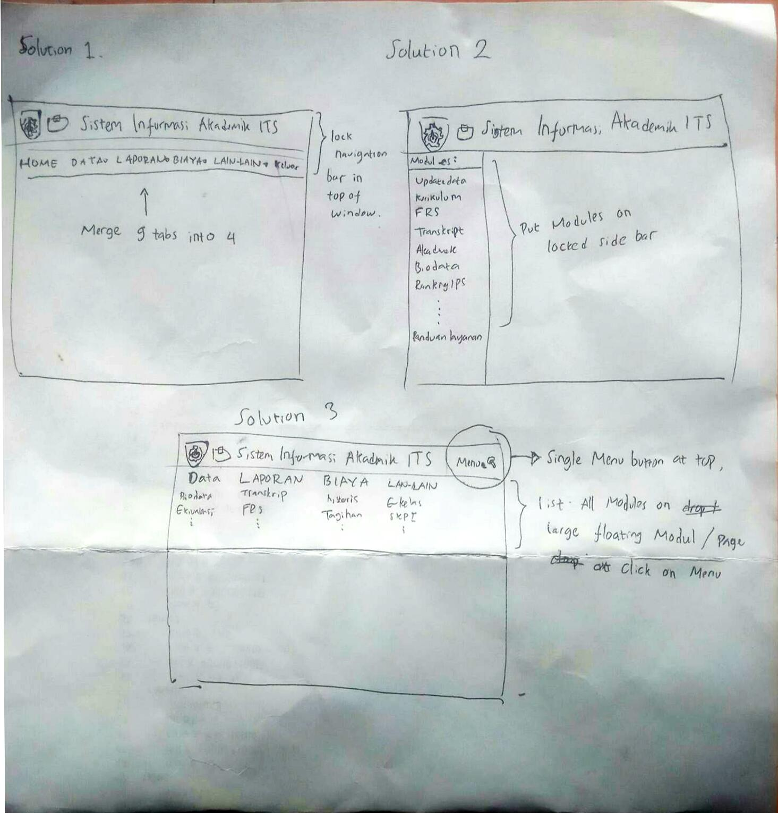

# Sketching and Prototyping

## Part A: Sketches

### 1. Scan/Photo of Sketches

## Problem:
Unclear and confusing grouping of the modules on the navigation bar, and all modules put on directly on main page in home page, make home seems a bit dirty 



### 2. Version Differences

#### Solution 1
- Merge 9 tabs of navigation bar into only 4 tabs
- Lock navigation bar in top of the window so that there is no need to scroll up to top when you want to change to another page

#### Solution 2

- leave navigation bar with only home and sign out buttons, and status
- Put modules on sidebar/panel, sorted by most accessed first

#### Solution 3

- Hide the whole navigation bar
- Put single Menu button in top right corner, adjacent to the page header
- lock page header on top of window
- The navigation bar is shown when menu button toggled, showing all modules in a large container, designed like modul or floating page

### 3. Selected Sketch
```
Writer choose solution three, because it can simplify the design, easy to use, and effective in a way to differenciate the task on the page and navigating to another page
```

### 4. Design Rationale
```
Assignment 1 can help us to understand how users think and feel about current design and problems of our feature. 
```

## Part B: Assumptions
### 1. Hardware
```
Screen size : 14 inch
Screen resolution : higher than 640 x 480 , ratio 4:3 with color
Computer minimum reqirement: 
	Processir:  Intel Core 2 Duo 2.0 GHz, AMD Athlon 64 X2 2.0 GHz or better,
	VGA : Intel HD Graphic, 
	RAM : 2 GB
Physical button : mouse and keyboard
```
### 2. Users
```
SIAKAD ITS is only accessible by students or lecturer of ITS. So the users is commonly on 17 to 60+ years old. As an academic structure members, users is expected to have a good or atleast the minimum experience and familiarity with computer or gadget
```

## Part C: Prototypes
We will work on this part together during the class on **March 21st, 2019**, 10:00 AM - 12.30 PM. Therefore, prior to the class please complete all the above parts (A & B) beforehand accordingly.
